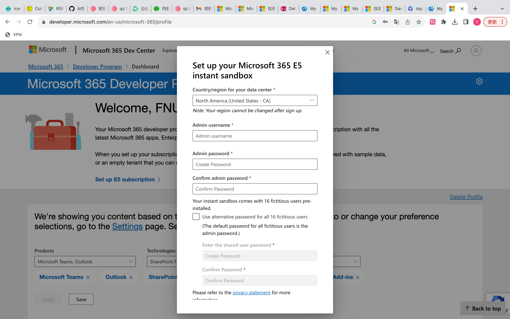

## 1. 注册账号

### 1.1 搜索微软Office365开发者计划，进入下图选中的页面

### 1.2 加入人员开发者计划

### 1.3 点击立即加入后根据自己信息注册网站

#### 注意：请使用xxxxxxx@outlook.com的格式

#### 公司可以自己随便编写，下面两块全部勾选

#### 推荐选择第一个

#### 全部勾选

#### 进入后直接点击Next

#### 根据自己信息勾选，注意下面不需要勾选

## 2. 准备下载（两种）：

### 1 安卓用户需采用如下网页下载的方法

### 2 苹果用户可直接进入app store搜索Microsoft下载，也可以采用网页下载

### 2.1 点击下图方框内Go to subscription

### 2.2 会进入如下页面，点击上方头像，再点击View account

### 2.3 点击 apps&devices 后，点击Install即可开始下载，大概需要5-10分钟

### 2.4 安装包下载完成后，根据提示点击，成功后会出现在桌面上

## 3. 激活

### 3.1 选择任意一个点击进入后，点击下图方框内，会在选项框里出现激活选项（本人已激活所以没有出现激活选项），然后根据提示激活

#### 注意：激活任意一个后，其余四个也会自动激活

### 3.2 激活完成后即可使用

### 自己的账户（容易忘哈哈哈）

