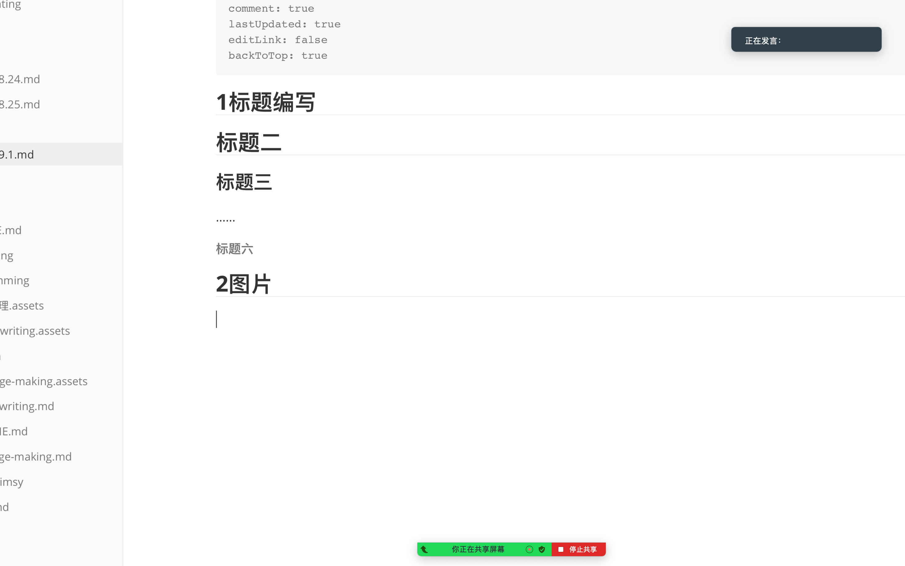
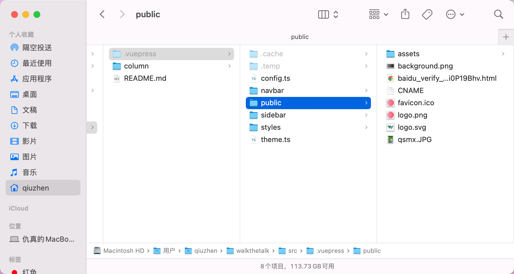

## 1标题编写

## 标题二

### 标题三

……

###### 标题六

## 2图片



## 3代码

英文输入法下 “1”左边按键，按三次，并输入编程语言的类型，然后回车。

```python
```python
```

## 4任务列表

- [x] 减号+空格+英文中括号+x+空格   必须要在每行顶格  注意- [x] 

## 5无序列表

- 减号+空格

## 6有序列表

1. 数字+.+空格
2. 

## 7选项卡

::: tabs

@tab xxxx

123

@tab xx

abc

:::

## 8代码块分组

````
:::code-tabs
@tab code1
```python
print('a')
```
@tab code2
```python
print('b')
```
:::
````

在代码块中只是为了内部显示

:::code-tabs
@tab code1

```python
print('a')
```
@tab code2
```python
print('b')
```
:::

## 9图表

## 10数学语法 

:::center    居中

$\large\frac{x^2}{x+y}$

:::

## 11卡片功能（跳转链接）


```card
title: qz
desc: 仇真
logo: /logo.png
link: 
color: rgba(253,230,138,0.15)
```

## 12访达内显示隐藏文件

command+shift+。



所有图片放到public里面，/代表public起步

## 13 b站插入

<BiliBili bvid="BV1wG411o7nq" />


## 14 PDF插入

<PDF url="/sample.pdf" />

写public下面的路径

## 15自定义容器

::: info 温馨提示

大家好，我是仇真

:::

::: note 注释

注释容器

:::

:::tip 我是你的提示

提示容器

:::

更多容器

````
::: info

信息容器。

:::

::: note

注释容器。

:::

::: tip

提示容器

:::

::: warning

警告容器

:::

::: danger

危险容器

:::

::: details

详情容器

:::

::: info 自定义标题

一个有 `代码` 和 [链接](#演示) 的信息容器。

```js
const a = 1;
```

:::

::: note 自定义标题

一个有 `代码` 和 [链接](#演示) 的注释容器。

```js
const a = 1;
```

:::

::: tip 自定义标题

一个有 `代码` 和 [链接](#演示) 的提示容器。

```js
const a = 1;
```

:::

::: warning 自定义标题

一个有 `代码` 和 [链接](#演示) 的警告容器。

```js
const a = 1;
```

:::

::: danger 自定义标题

一个有 `代码` 和 [链接](#演示) 的危险容器。

```js
const a = 1;
```

:::

::: details 自定义标题

一个有 `代码` 和 [链接](#演示) 的详情容器。

```js
const a = 1;
```

:::

::: info 自定义信息
:::

::: note 自定义注释
:::

::: tip 自定义提示
:::

::: warning 自定义警告
:::

::: danger 自定义危险
:::
````

::: info

信息容器。

:::

::: note

注释容器。

:::

::: tip

提示容器

:::

::: warning

警告容器

:::

::: danger

危险容器

:::

::: details

详情容器

:::

::: info 自定义标题

一个有 `代码` 和 [链接](#演示) 的信息容器。

```js
const a = 1;
```

:::

::: note 自定义标题

一个有 `代码` 和 [链接](#演示) 的注释容器。

```js
const a = 1;
```

:::

::: tip 自定义标题

一个有 `代码` 和 [链接](#演示) 的提示容器。

```js
const a = 1;
```

:::

::: warning 自定义标题

一个有 `代码` 和 [链接](#演示) 的警告容器。

```js
const a = 1;
```

:::

::: danger 自定义标题

一个有 `代码` 和 [链接](#演示) 的危险容器。

```js
const a = 1;
```

:::

::: details 自定义标题

一个有 `代码` 和 [链接](#演示) 的详情容器。

```js
const a = 1;
```

:::

::: info 自定义信息
:::

::: note 自定义注释
:::

::: tip 自定义提示
:::

::: warning 自定义警告
:::

::: danger 自定义危险
:::

## 16自定义对齐

::: left

左对齐的内容

:::

::: center

居中的内容

:::

::: right

右对齐的内容

::: justify

两端对齐的内容

:::

## 17插入链接

[我的网站](https://weonlygettoday.com)

## 18详细信息展开

::: details 详细信息

xxxxxxx

:::

## 19如何删除大量信息

点击最开始处，划到最后，长按shift键，点击最后（要在图片的下一行），按回车

