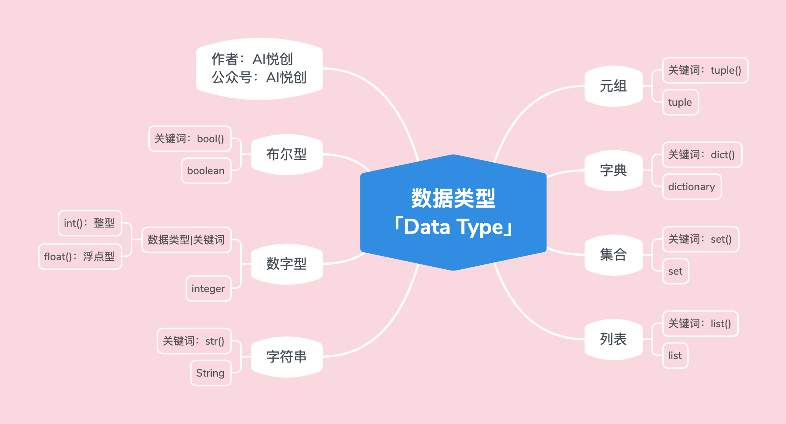

---

title: 数据类型
date: 2023-09-22 07:16:10
author: 仇真
isOriginal: true
category: 
    - python学习
tag:
    - python学习
icon: jiqiren
sticky: false
star: false
article: true
timeline: true
image: false
navbar: true
sidebarIcon: true
headerDepth: 5
comment: true
lastUpdated: true
editLink: false
backToTop: true
---

## 1 数字型「int、float」

### 1.1 代码示例

1. 整型

```python
int_num = 1
t = type(int_num)
print("int num type is:>>>",t)
print("直接检测数据类型，并输出:>>>",type(int_num))

# output
int num type is:>>> <class 'int'>
直接检测数据类型，并输出:>>> <class 'int'>
```

2. 浮点数

```python
float_num = 1.5
t = type(float_num)
print(float_num)
print("float num type is:>>>",t)
print("直接检测数据类型，并输出:>>>",type(float_num))

# output
1.5
float num type is:>>> <class 'float'>
直接检测数据类型，并输出:>>> <class 'float'>
```

## 2 字符串「str」

### 2.1 代码示例

```python
string = "Hello qz"
t = type(string)
print(string)
print("string type is:>>>",t)
print("直接检测数据类型，并输出:>>>",type(string))

# output
Hello qz
string type is:>>> <class 'str'>
直接检测数据类型，并输出:>>> <class 'str'>
```

### 2.2 字符串三大特性

1. 有序性

a 从左到右，下标是从 0 开始；

b 从右到左，下标是从 -1 开始；

c 引号中出现的，都算一个下标；

2. 不可变性

a 字符串被创建出来后就不能被改变；

注意：修改不等于覆盖，我们说的不可变，是在代码运行的过程中，不能对字符串有修改、添加、删除之类的操作；

3. 任意字符

a 键盘上可以输入的字符，都可以是字符串的元素；

b 字符放到字符串中，都将成为字符串类型。「也就是说：里面每一个元素都可以称为子字符」

## 3. 列表「list」

### 3.1 代码示例

```python
lst = ["Hello QZ",1,1.1,("look","book",11),[12,"qzz"],True,False]
t = type(lst)
print(lst)
print("lst type is:>>>",t)
print("直接检测数据类型，并输出:>>>",type(lst))

# output
['Hello QZ', 1, 1.1, ('look', 'book', 11), [12, 'qzz'], True, False]
lst type is:>>> <class 'list'>
直接检测数据类型，并输出:>>> <class 'list'>
```

### 3.2 列表的三大特性

1. 有序性

a 从左到右，下标是从 0 开始；

b 从右到左，下标是从 -1 开始；

c 列表里的每个元素算一个；

1. 比如：lst = [“qzzzzzz”,12]

2. 上面 lst 有两个元素，下标分别是：

    1.qzzzzzz 是 0，也是 -2；

    2.12下标是 1，也是 -1；

2. 可变性

在程序运行过程中，列表可以「添加、删除、修改」

3. 任意数据类型

注意：这里说的任意数据类型，指的是 Python 所拥有的数据类型；比如♾️️不能直接使用，必须当作字符串来使用，或是当作变量来使用

::: details Python 所拥有的数据类型。



:::

## 4.0 元组

### 4.1 代码示例

```python
tup = (1,2,3,4,"aiyc",1.1,[1,2,3,4])
t = type(tup)
print(tup)
print("tup type is:>>>",t)
print("直接检测数据类型，并输出:>>>",type(tup))
```

### 4.2 元组的三大特性

1. 有序性

a 从左到右，下标是从 0 开始；

b 从右到左，下标是从 -1 开始；

2. 不可变性

a 字符串被创建出来后就不能被改变；

注意：修改不等于覆盖，我们说的不可变，是在代码运行的过程中，不能对字符串有修改、添加、删除之类的操作；

3. 任意数据类型

## 5.0 探究「列表&元组」

::: info 温馨提示

为什么有列表后，还需要元组

:::

1. 如果存储的数据或数量是可变的，比如社交平台上的一个日志功能，是统计一个用户在一周之内看了哪些用户的帖子——那么则用列表更合适。
2. 如果存储的数据和数量不变，比如你有一个系统（软件），需要返回的是一个地点的经纬度，然后直接传给用户查看——那么肯定选用元组更合适。

::: note

注意：需要根据情况灵活机动应变。如你需要每天更新一些经纬度，那就可以把一组设为元组，总体设为列表。

可以全列表，也可以全元组，也可元组列表结合

区别：1. 列表可直接添加，元组需新建后添加

2.列表需时时跟踪状态，元组不需要，可直接新建添加

既有确定，也有不确定的部分比较难？

!!! 元组要重新再打一遍来覆盖

:::

```python
tup = (1,2,3,4)
tup = (1,2,3,4,"q","z","nice")
new_tup = tup + ("q","z","nice")
print(new_tup)

# output
(1, 2, 3, 4, 'q', 'z', 'nice', 'q', 'z', 'nice')
```


- **假设**

    - 假设1：现在有一个仓库，你要向仓库添加物品。仓库很大，现用的物品也很多，你不知道还有没有位置可以存放。此时我们是不是需要聘请一个仓库管理员，这样我们就可以直接问仓库管理员：里面还有哪个位置（是否有位置？）仓库管理员会告诉你，并且你可以直接把你的物品，添加进去。

        问题来了，仓库管理员为什么知道仓库是否有位置？——因为仓库管理员会一直跟踪这个仓库的状态；

    - 假设2：现在有一个原子弹的仓库，仓库创建之后，只能存放一个原子弹。那么，我们需要设立一个专门的人员跟踪：原子弹仓库的状态吗？——不需要，此时在聘请一个就显得浪费了。（不然，领导没油水了～hhhhh）

- **Why？**

    - 用户日志📔，是不是会一直变动（记录📝看了哪些帖子），我们是不是需要有一个类似仓库管理员的“人”，来跟踪并且知道：是否有位置（是否有空间/内存），还需要知道在哪里添加。——列表更合适，因为列表可变。「可变意味着：添加、删除、修改」
        - 元组为什么不合适？——因为，你每当需要添加数据的时候，就得重新创建一个新的元组。（就类似于：你创建原子弹的仓库，肯定是刚刚好可以存放一个，那么你想存放两个的时候，只能重新再创建一个仓库。）
    - 经纬度会改变吗？显然是不会的，那么就不需要一个多余的“人”去跟踪状态。——用列表可以吗？可以！但是没必要。「因为我们不需要仓库管理员」用列表有点浪费资源了。元组的功能刚刚好够用。
    - **<span style="color:orange">我们讲究：不浪费，合适就好。</span>**

## 6.0 字典

### 6.1 代码示例

```python
dic = {"name":"qz","age":18,1:"int",1.1:1,"tup":(1,2,3)}
t = type(dic)
print(dic)
print("tup type is:>>>",t)
print("直接检测数据类型，并输出:>>>",type(dic))
```

### 6.2 字典的特性

1. 无序性

2. 字典的组成：

```python
d = {“key1” : “value1” , “key2” : “value2” , ……}
```

3. key：不可变的数据类型才可以当key，比如：字符串，数字，布尔，元组

4. value：任意数据类型

5. 可变性：可以添加、修改、删除键对值

## 7.0 集合

### 7.1 代码示例

```python
set1 = {1,2,"qzzz",1.1,"book",(1,2,3),False}   # set 是函数不能用
t = type(set1)
print(set1)
print("set1 type is:>>>",t)
print("直接检测数据类型，并输出:>>>",type(set1))

# output
{False, 1, 2, 1.1, 'book', (1, 2, 3), 'qzzz'}
set1 type is:>>> <class 'set'>
直接检测数据类型，并输出:>>> <class 'set'>
```

### 7.2 集合的特性

1. 无序性：集合是没有顺序的，也就是没有下标；

:::note

如果运行很多次中的某一次，集合顺序没有改变，也不能说集合是有序的。—只是概率问题

:::

2. 确定性：集合的每一个值都是确定的；「也就是需要不可变的数据类型」
3. 比如：数字型、布尔、元组、字符串；列表不行


