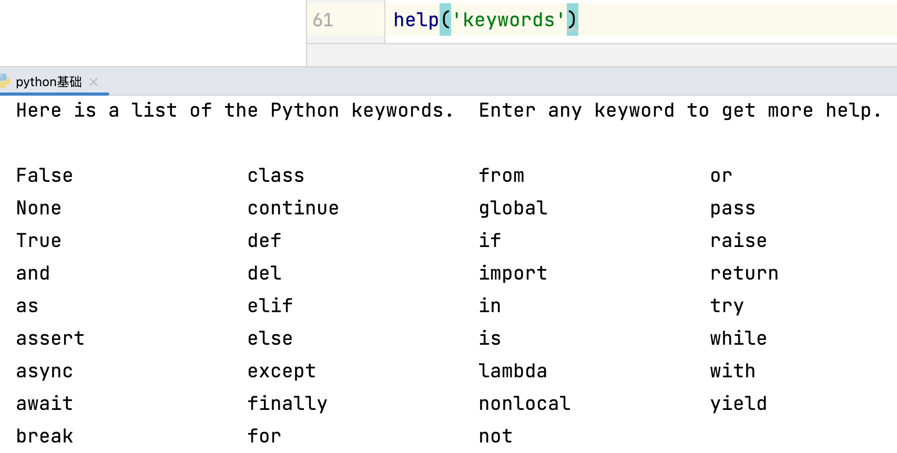

---

title: 初识变量
date: 2023-09-04 07:29:24
author: 仇真
isOriginal: true
category: 
    - python学习
tag:
    - python学习
icon: jiqiren
sticky: false
star: false
article: true
timeline: true
image: false
navbar: true
sidebarIcon: true
headerDepth: 5
comment: true
lastUpdated: true
editLink: false
backToTop: true
---

你好，我是仇真。

## 1. 理解变量

### 1.1 从字面意思去理解

变量—变化的数量/大小

### 1.2 形象的比喻

在计算机内存中开辟一个可以放东西的空间，如信封、冰箱……

### 1.3 举个例子

假如，你是班级当中的课代表，每个月需要统计班级中每个学生的月考成绩。月考成绩会每个月一张纸，每张纸上都会依次记录每个学生的成绩月考成绩，例如：

1. 李雷    98分
2. 马冬梅    89分
3. 刘奕彤     96分
4. ......

某一天，老师要看刘奕彤 1月、2月、3月的成绩，这个时候作为课代表的你需要怎么办。——总不能直接把每个月的月考成绩单直接给老师，显然是不合适的。

我们应该把刘奕彤 1月、2月、3月的成绩抄写到单独的一张纸上，接着给老师。

那么，我们为什么不一开始直接为每一个学生分配一个信封呢？（也可以是档案袋）信封在一开始是扁的，当我们放东西（数据）进去之后，是不是鼓起来了？——是不是变化了？是不是有大小了呢？显然是的。

那么信封，是不是在我们当前所处的空间当中开辟空间，来存放数据并且说这是信封。

类似的有：冰箱，不也是在我们当前所处的空间中，开辟空间。

——所以，变量不就是在计算机的内存当中开辟空间，来存储数据。

### 1.4 变量会被覆盖

空间中只有一个位置，只能把数据叠放，所以最终显示出的是最后赋予的值。

## 2. 如何创建变量—赋值语句

### 2.1 变量

通过变量名代表或引用某个值

### 2.2 初始化赋值语句

变量名 = 表达式  

注意：“=”为赋值运算符，并不是相等，而是赋值。举例：x=3

程序的运行逻辑：先从上到下，再从右到左，最后才是赋值（先一行行运算，再运算右边，最后赋值给左边）

:::code-tabs

@tab demo1

```python
x = 1
x = x + 10
print(x)  # print 打印输出
# 井号是注释作用：我们看得见，计算机看不算，属于代码的注解、说明
```

@tab demo2

```python
name1 = "lilei"
name2 = name1 # 变量值的传递
print(name2)
# 注释快捷键：Command + /

name1 = "lilei"
name1 = "qiuzhen" # 变量值的覆盖
print(name1)

# output
lilei
qiuzhen
```

:::

## 3. 探究print

### 3.1 同时输出多个数据

```python
a = 1
b = 1
c = 1
print(a, b, c) # print 同时输出多个变量，默认以空格间隔

# output
1 2 3
```

默认以空格间隔，可以使用sep修改。

### 3.2 sep 修改多个变量同时输出的间隔

:::code-tabs

@tab demo1

```python
print(a, b, c) # print 同时输出多个变量，默认以空格间隔
print(a, b, c, sep="") # 双引号里是什么就以什么间隔

# output
1 1 1
111
```

@tab demo2

```python
print(a, b, c, sep="xdsnqlo")

# output
1xdsnqlo1xdsnqlo1
```

:::

### 3.3 end 修改 print 输出结尾的方式

::: code-tabs

@tab 原本

```python
a = 1
b = 1
c = 1
print(a)
print(b)
print(c) # 默认以换行结尾

# output
1
1
1
```

@tab1

```python
a = 1
b = 1
c = 1
print(a, end="\n\n\n") # \n 代表一次换行
print(b,end="xsolanqxaojsc")
print(c,end=",")

# output
1


1xsolanqxaojsc1,
```

:::

### 3.4 end 和 sep 可以同时使用

```python
a = 1
b = 1
c = 1
print(a, b, c, sep="-", end="love qz")
print(a, b, c, sep=" ", end="\n")
print(a, b, c, end="love qz") # end 只会针对此 print

# output
1-1-1love qz1 1 1
111
1 1 1love qz
```

### 变量专项练习 例题 1 交换果汁

假如你有两个小孩，哥哥叫：Austin，弟弟叫：Jaden。

Austin 想喝**果汁**，Jaden 想喝**可乐**。**哥哥和弟弟都有专属的杯子，不喜欢用对方的杯子。**

家中仅剩一杯果汁、一杯可乐，你不小心把哥哥的杯子装了可乐，弟弟的杯子装了果汁。

**问：如何交换哥哥与弟弟杯中的果汁？**

:::code-tabs

@tab 通用

```python
Austin = "Coke"  # 该赋值可以理解为倒果汁的过程
Jaden = "juice"  # 该赋值可以理解为倒果汁的过程
print("Austin", Austin)
print("Jaden", Jaden)
cup1 = Jaden     # 答案 #注意：在没有新饮料的情况下，要交换饮料，而不是重新到两杯
Jaden = Austin   # 答案 #思路：必须有一个新容器来存放其中一种饮料，一个杯子空了之后就可以换入对的饮料，再把空杯子内的饮料倒入另一个杯子
Austin = cup1    # 答案
print("Austin", Austin)
print("Jaden", Jaden)

# output
Austin Coke
Jaden juice
Austin juice
Jaden Coke
```

@tab python专属

```python
Austin = "Coke"  # 该赋值可以理解为倒果汁的过程
Jaden = "juice"  # 该赋值可以理解为倒果汁的过程
print("Austin", Austin)
print("Jaden", Jaden)
Austin,Jaden = Jaden,Austin  # 答案 
print("Austin", Austin)
print("Jaden", Jaden)

# output
Austin Coke
Jaden juice
Austin juice
Jaden Coke
```

:::

### 例题 2 创建变量并输出

1. 输出效果：

```python
Austin Jaden Alex Cava
```

1. 输出效果如下：

```python
Austin$Jaden$Alex$Cava%
```

```python
a="Austin"
b="Jaden"
c="Alex"
d="Cava"
print(a,b,c,d)
print(a,b,c,d,sep="$",end="%")

# output
Austin Jaden Alex Cava
Austin$Jaden$Alex$Cava%
```

### 3.5 变量命名规则

- 大小写英文、数字和`_`的结合，且不能用数字开头；

- 系统关键词不能做变量名使用； 获取关键字列表：help(‘keywords’)

- python中的变量名区分大小写；

- 变量名不能包含空格，但可以使用下划线来分隔其中的单词；

- 不要使用python的内置函数名称做变量名；

    


:::code-tabs

@tab Code1

```python
n = "A"
N = "a"
print(n) # 如果不区分大小写的话，输出什么结果？---a
# 但是，它区分大小写，所以输出 A

# output
A
```

@tab Code2

```python
# 数字不能开头
a121iy212c21 = "a" # 数字不能开头，除了开头，其他都可以
```

@tab Code3

```python
user_name = "aiyc"
```

@tab Code4

```python
print = "aiyc"
print(print) # 内置函数名不能当做变量名
```

@tab Code5

```python
# 关键词不能当做变量名
await = "aiyc"
print(while) # await 在 Python 当中有特殊功能，比如 while
```

:::


