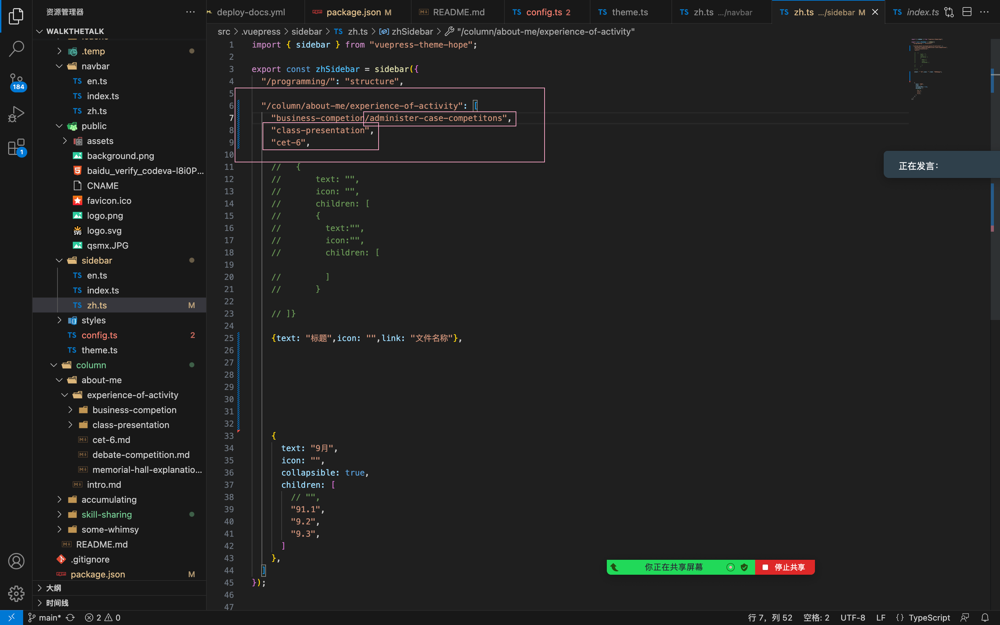
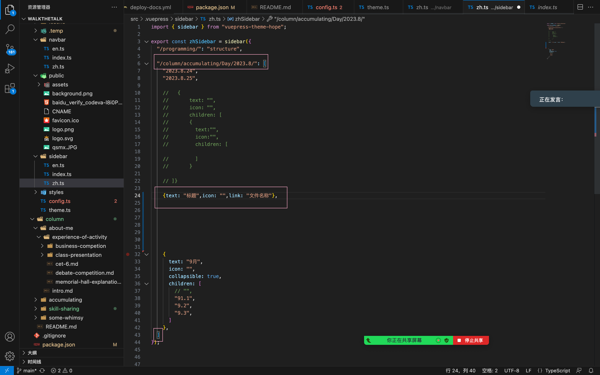
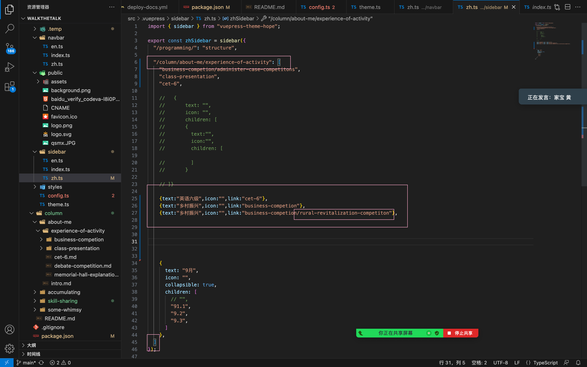
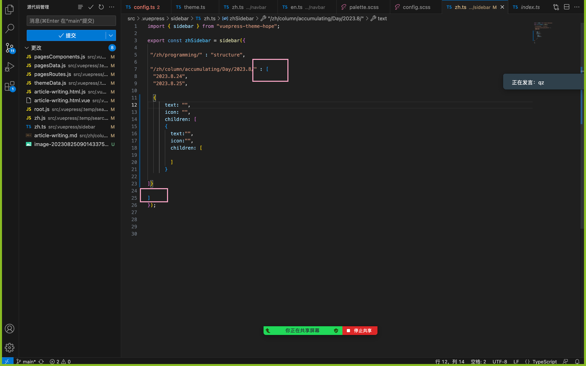
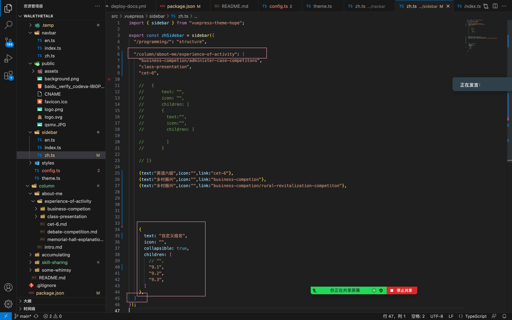
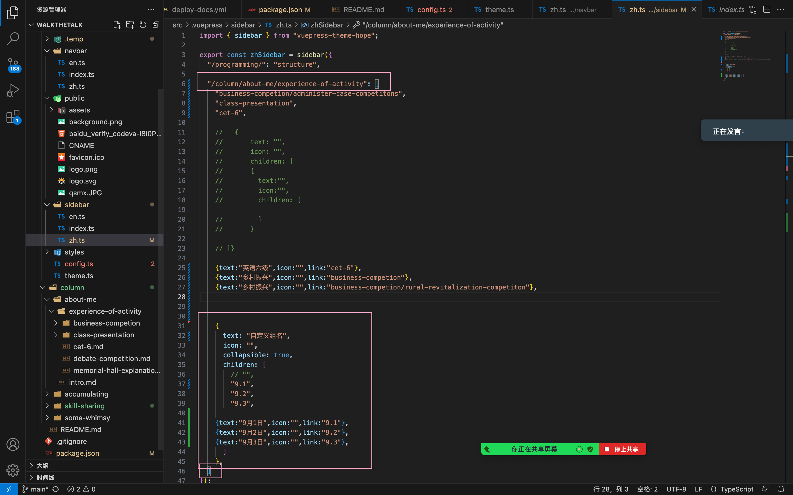
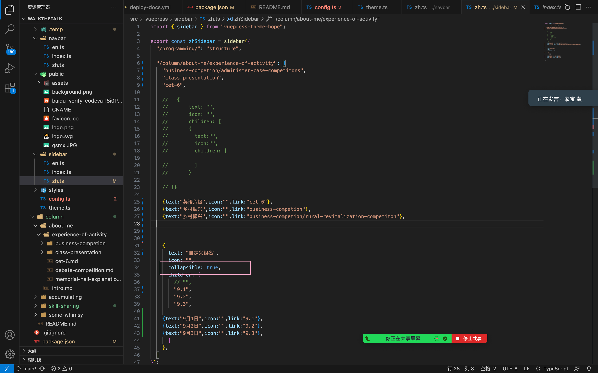
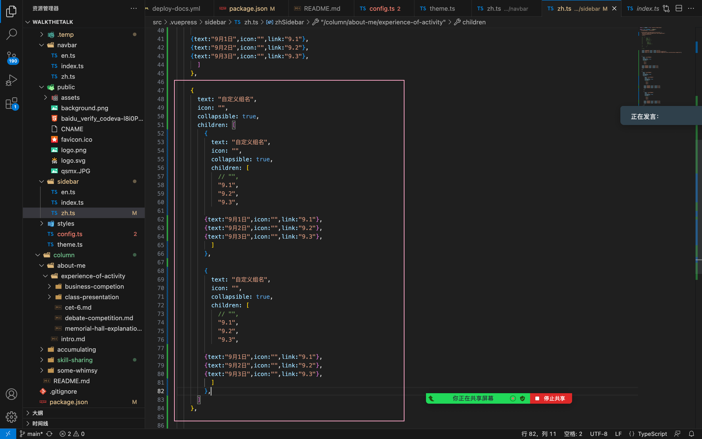
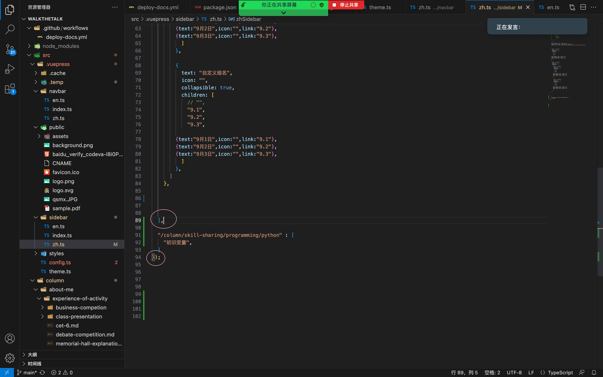

## 1.如何手动编写侧边栏

### 1.1第一种方法 侧边栏名称无法自定义



## 注意输入文件夹和文件后的显示效果

**注意文件名和title：

输入的是文件名，用于识别；网页中侧边栏真正显示的是title


### 1.2第二种方法 自定义文件名&图标





注意大文件夹下直接有文件和还有一个文件夹

## 如何放置代码框


```python
```

## 看清楚路径包裹范围



## 1.3



## 1.4



## 可折叠



## 1.5自定义 一个大组里面套多个小组






